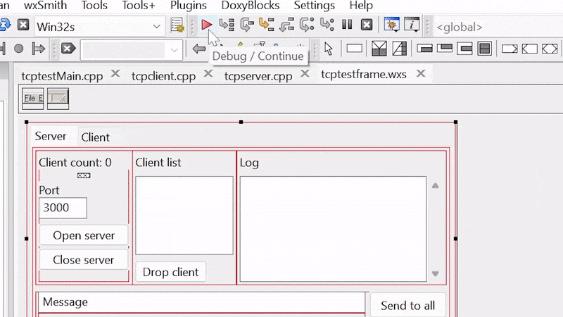
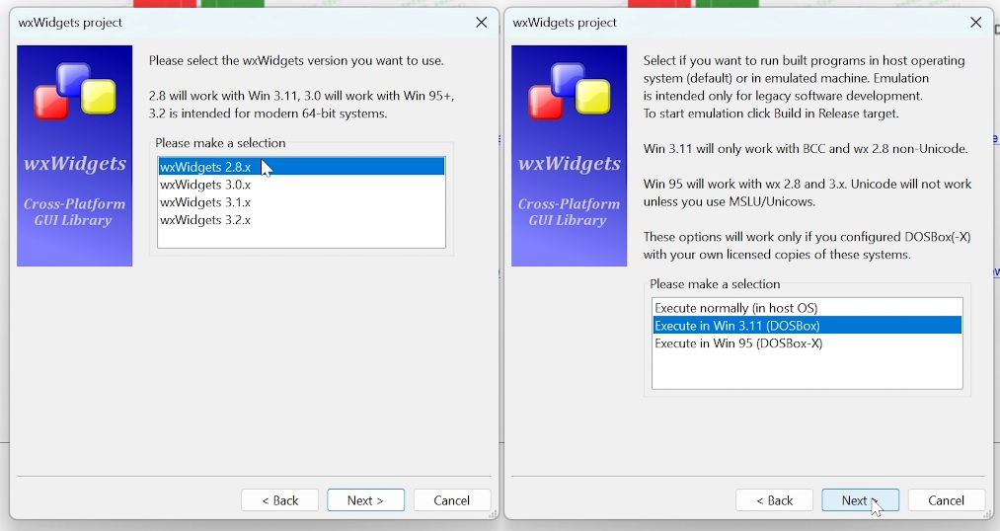
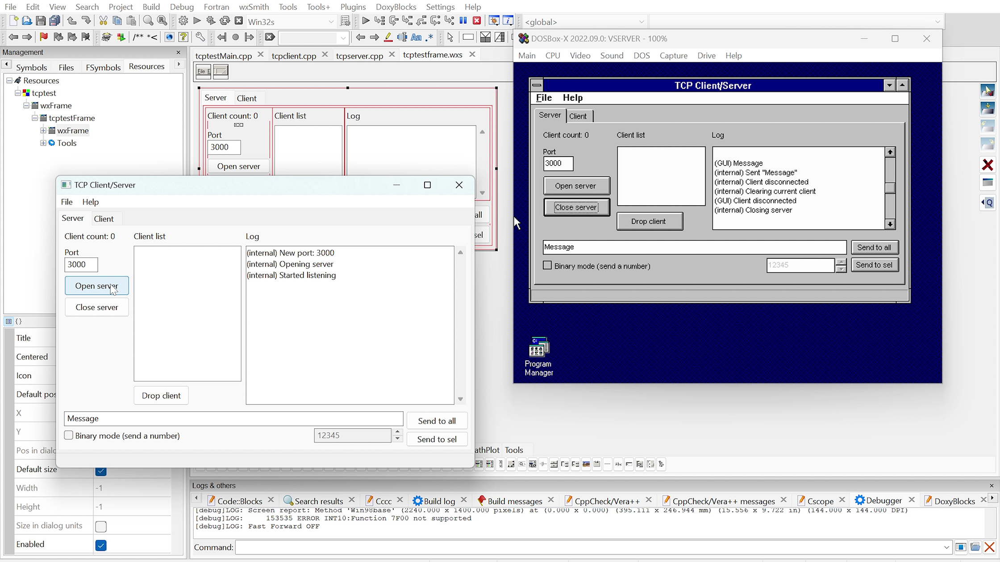
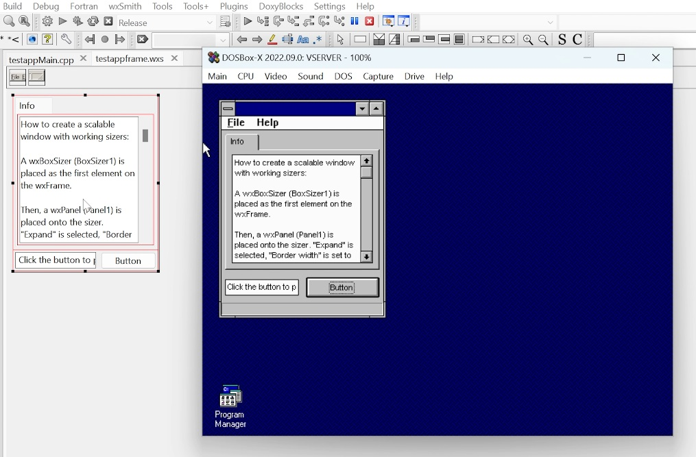
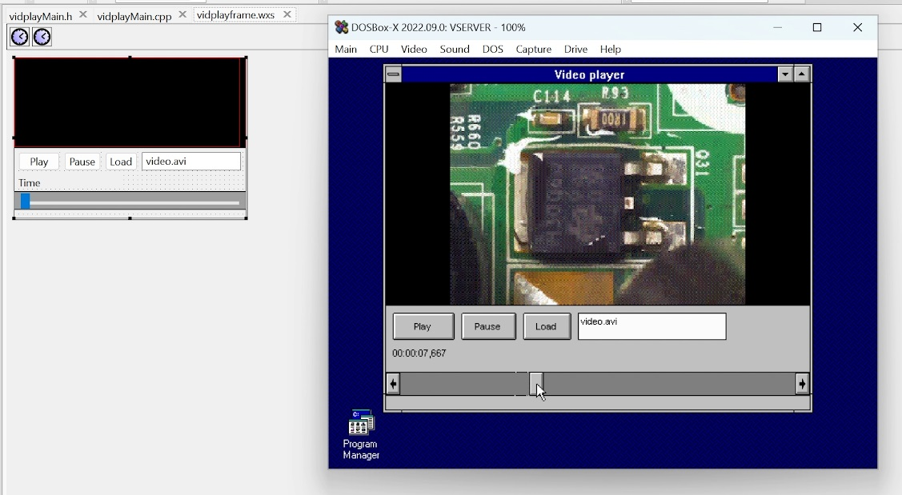
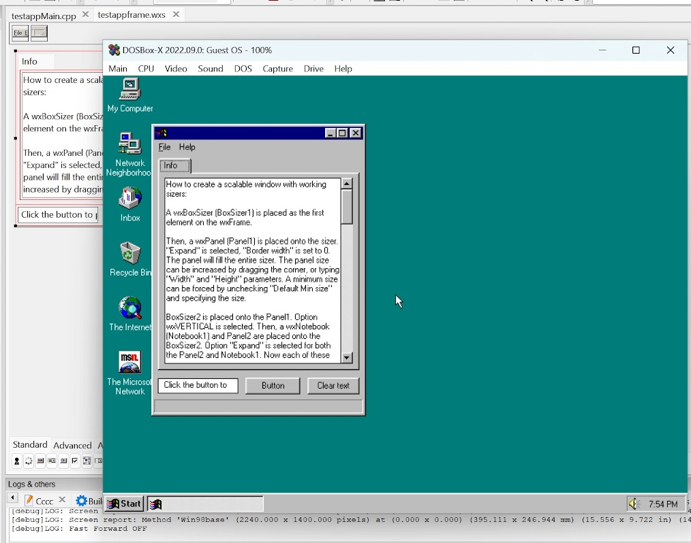

# cb-legacy-dev: CodeBlocks for Legacy Software Development

This is an IDE installer which creates a pre-configured environment that allows rapid GUI application development for Windows 3.11/Win32s (!), Windows 9x or modern targets, even with cross-platform capabilities.
It uses a bunch of configuration files, installation scripts, compilers, frameworks, sample C++ projects and wizard templates. This project heavily relies on CodeBlocks and wxWidgets framework.

The main idea was to simplify the process of making simple applications for legacy systems as much as possible (you can create and run a test application for Windows 3.11 in less than a minute thanks to built-in configuration wizard).
And thanks to wxWidgets, which miraculously can work with Win32s-extended Windows 3.11 allows to avoid writing platform-specific code for an ancient system.  The most recent version that works with Win32s is 2.8.12.

**Video overview and tutorial: https://youtu.be/d6L272OApVg**

**Features:**
* Automatic installer (single batch file)
* Pre-configured CodeBlocks IDE
* Windows 3.11 and Windows 95 integrated with IDE (using DOSBox-X): you can build and run the application in Win 3.11/95 with a single mouse click
* Automatic Windows 3.11/95 installation in DOSBox-X: you provide your own genuine installation disks/CD
* Mouse and network integration between Win 3.11/95 guests and host system
* Easy GUI development thanks to wxWidgets and easy-to-use configuration wizards
* wxWidgets modified to work with Win 3.11 targets (version 2.8.12), version 3.0.5 modified to work with Win 95
* Unicode for Win 9x targets thanks to MSLU/Unicows (works with wxWidgets 3.0.5)
* TDM-GCC 4.7.1 for Win9x+ targets, BCC5.5 compiler (needs to be downloaded separately) for Win 3.11/Win32s targets
* MinGW-w64 and wxWidgets 3.2 for modern 64-bit targets
* As a bonus: DJGPP and OpenWatcom compilers for DOS (with DOSBox integration)

**Prerequisites:**
* Windows for Workgroups 3.11 English version installation disks - for Win 3.11 IDE integration
* Windows 95 OSR2 English installation CD (WIN95 subdirectory) - for Win 95 IDE integration
* free Borland 5.5 C++ compiler - installation script will try to download it automatically
* drivers and updates for Win 3.11/Win 95 - installation script will try to download them automatically

**Screenshots:**

